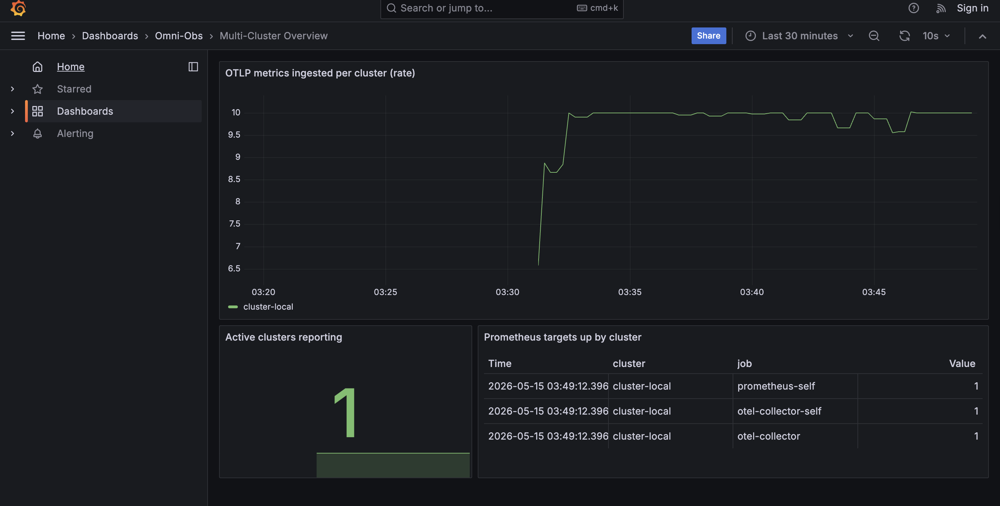
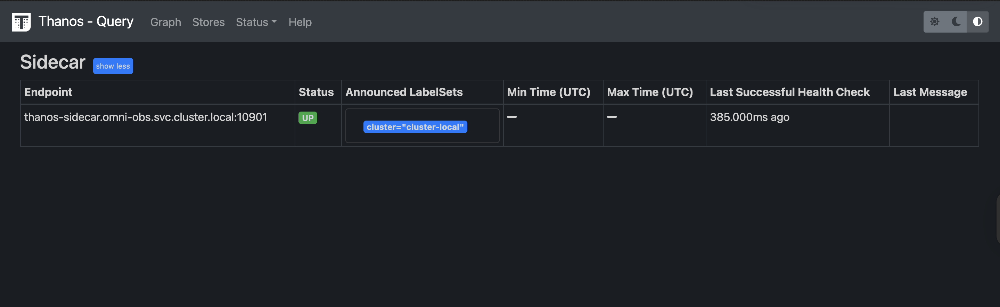

# Omni-Obs — Federated Multi-Cluster Observability Platform

> A production-shaped, locally-runnable observability platform that federates metrics from three simulated cloud regions (AWS / Azure / GCP) into a single global query view using OpenTelemetry, Prometheus, Thanos, and Grafana.

[](https://github.com/Kanim21/omni-obs-platform/actions/workflows/ci.yml)
[](LICENSE)

## Demo

Single-cluster mode — the OTel → Prometheus → Thanos sidecar → MinIO → Thanos Query pipeline running end-to-end on one kind node, fitting comfortably in 5 GiB of Docker memory:



Thanos Query Stores — the local sidecar connected and serving the full retention window:



Multi-cluster mode (4 kind clusters federated) is also supported — see the `make demo` section below.

## What this is

A demo of the **federated tiered-storage** pattern for multi-cluster observability. Each "edge" cluster runs its own ingestion and storage stack; a separate "central" cluster aggregates them via Thanos's StoreAPI. Querying any metric returns a unified, deduplicated view across all clusters.

The whole thing runs locally on **`kind` clusters** in Docker, so you can stand it up on a laptop in a few minutes — no cloud account required. There are two ways to run it:

- **`make demo-single`** — one kind cluster, full pipeline including object storage (MinIO). Fits in 5 GiB Docker memory, suitable for an 8 GiB laptop. **Start here.**
- **`make demo`** — four kind clusters (3 edge + 1 central) with cross-cluster federation. Needs 8+ GiB Docker memory.

The Kubernetes manifests, overlays, and topology mirror what a real multi-region deployment looks like — the only difference between the two modes is scale.

## Architecture


**Per-cluster pipeline:** apps emit OTLP → OpenTelemetry Collector receives and exposes Prometheus-format → Prometheus scrapes locally → Thanos sidecar exposes the local TSDB over gRPC StoreAPI.

**Federation:** the central Thanos Query connects to every edge sidecar and presents one unified PromQL endpoint. Grafana points at it.

## Quick start

**Prerequisites** (macOS):

```bash
brew install docker kind kubectl kustomize
# Optional but recommended for `make validate`:
brew install kubeconform kube-linter
```

Docker Desktop must be running with **at least 5 GiB of memory allocated for single-cluster mode, or 8 GiB for full multi-cluster mode** (Settings → Resources).

### Single-cluster mode (`make demo-single`) — recommended

```bash
git clone https://github.com/Kanim21/omni-obs-platform.git
cd omni-obs-platform
make demo-single
```

That command runs preflight checks, creates one kind cluster, deploys the full stack (OTel + Prometheus + Thanos sidecar + MinIO + Thanos Query + Grafana + telemetrygen load generator), and is ready in about 3 minutes.

**Open Grafana:**

```bash
kubectl -n omni-obs port-forward svc/grafana 3000:3000
open http://localhost:3000   # admin / admin (demo only)
```

**Confirm the pipeline directly:**

```bash
kubectl -n omni-obs port-forward svc/thanos-query 9090:9090
open http://localhost:9090/stores
```

You should see one sidecar listed with the full retention window. Run any PromQL query (`up`, `rate(otelcol_receiver_accepted_metric_points_total[5m])`) in the Graph tab to confirm data is flowing.

**Tear down:**

```bash
make teardown-single
```

### Multi-cluster mode (`make demo`)

For machines with 8+ GiB Docker memory:

```bash
make demo
```

Spins up four kind clusters (cluster-aws, cluster-azure, cluster-gcp, cluster-central) and federates them. Total time: ~5 minutes.

**Confirm the federation:**

```bash
kubectl --context kind-cluster-central -n omni-obs port-forward svc/thanos-query 9090:9090
open http://localhost:9090/stores
```

You should see three sidecars listed (one per edge cluster) plus the full retention window.

**Tear down:**

```bash
make teardown
```

## Repo layout

```
.
├── Makefile                        # demo-single, demo, teardown, validate, etc.
├── kubernetes/
│   ├── base/                       # shared resources (namespace)
│   ├── components/
│   │   ├── edge/                   # OTel + Prometheus + Thanos sidecar + load gen
│   │   ├── central/                # Thanos Query + Grafana
│   │   ├── minio/                  # object storage for single-cluster mode
│   │   └── thanos/                 # Thanos Query for single-cluster mode
│   └── overlays/
│       ├── aws/  azure/  gcp/      # edge overlays — inject cluster labels
│       ├── central/                # query-tier overlay — wires sidecar endpoints
│       └── single/                 # single-cluster overlay — full stack on one node
├── scripts/
│   ├── preflight.sh                # tool/docker/port checks
│   ├── create-clusters.sh          # 4 kind clusters
│   ├── deploy.sh                   # apply overlays, discover endpoints
│   ├── verify.sh                   # end-to-end smoke test
│   ├── teardown.sh                 # delete all clusters
│   ├── validate.sh                 # CI-style static validation
│   └── lib/common.sh               # shared shell helpers
├── governance/
│   ├── adr/                        # architecture decision records
│   ├── runbooks/
│   └── slos/
├── terraform/                      # reference IaC for a real cloud deployment
└── .github/workflows/ci.yml        # validation pipeline
```

## What's demo-grade vs. production

This repo is honest about its limits. Things that are **realistic** in this design:

- The OTel → Prometheus → Thanos topology is exactly what a real federated deployment uses.
- Kustomize overlays match how clusters get differentiated in production GitOps.
- The Thanos Query → sidecar StoreAPI federation is the real protocol.
- Pod security (non-root, dropped capabilities, read-only root FS, seccomp) is production-shaped.

Things that are **demo simplifications** (each linked to what would change for production):

| Demo                                             | Production                                                 |
| ------------------------------------------------ | ---------------------------------------------------------- |
| Sidecar reachable via NodePort over Docker net   | Private LoadBalancer + mTLS, or Thanos Receive             |
| MinIO single-node, in-cluster                    | S3 / GCS / Azure Blob with lifecycle policies              |
| 2-hour Prometheus retention, no object storage   | Thanos sidecar + S3/GCS/Azure Blob, Compactor for downsampling |
| Grafana in-pod password = `admin`                | OIDC SSO, secret in Vault/External Secrets                 |
| Single Thanos Query, no caching                  | Query Frontend + cache, multiple Query replicas           |
| `kind` clusters on one Docker host               | Real EKS/AKS/GKE in separate VPCs                          |
| Load generator emits synthetic metrics           | Real workloads with OTel SDK instrumentation               |

See [`governance/adr/`](governance/adr) for the architecture decision records explaining why each choice was made.

## Testing & validation

```bash
make validate          # kustomize build + kubeconform + kube-linter on all overlays
make verify            # end-to-end: queries Thanos, asserts all 3 clusters report
```

CI (`.github/workflows/ci.yml`) runs `make validate` on every push and PR.

## Releases

- [v0.3.0](https://github.com/Kanim21/omni-obs-platform/releases/tag/v0.3.0) — single-cluster mode with Thanos + MinIO + Grafana
- [v0.1.0](https://github.com/Kanim21/omni-obs-platform/releases/tag/v0.1.0) — initial multi-cluster federation

## Documentation

- [`QUICKSTART.md`](QUICKSTART.md) — step-by-step walkthrough with troubleshooting
- [`PROJECT_SUMMARY.md`](PROJECT_SUMMARY.md) — what this project demonstrates and why
- [`governance/adr/`](governance/adr) — architecture decisions and tradeoffs
- [`governance/runbooks/`](governance/runbooks) — incident response procedures
- [`governance/slos/`](governance/slos) — service-level objectives
- [`CONTRIBUTING.md`](CONTRIBUTING.md) — development workflow

## License

MIT. See [LICENSE](LICENSE).

---

_Single-cluster mode last verified: 2026-05-15 · macOS 26.2 · Docker 29.3.1 · kind v0.31.0 · kubectl v1.36.0 · kustomize v5.8.1_
