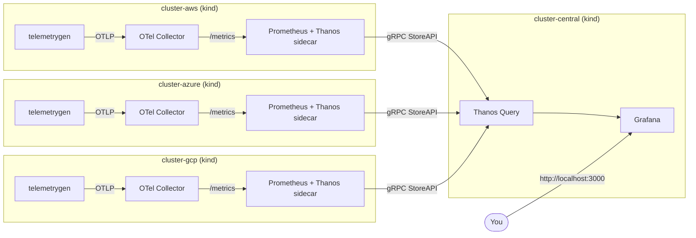

# Omni-Obs — Federated Multi-Cluster Observability Platform

> A production-shaped, locally-runnable observability platform that federates metrics from three simulated cloud regions (AWS / Azure / GCP) into a single global query view using OpenTelemetry, Prometheus, Thanos, and Grafana.

[](https://github.com/Kanim21/omni-obs-platform/actions/workflows/ci.yml)
[](LICENSE)

## What this is

A demo of the **federated tiered-storage** pattern for multi-cluster observability. Each "edge" cluster runs its own ingestion and storage stack; a separate "central" cluster aggregates them via Thanos's StoreAPI. Querying any metric returns a unified, deduplicated view across all clusters.

The whole thing runs locally on **four `kind` clusters** in Docker, so you can stand it up on a laptop in a few minutes — no cloud account required. The Kubernetes manifests, overlays, and topology mirror what a real multi-region deployment looks like.

## Architecture



**Per-cluster pipeline:** apps emit OTLP → OpenTelemetry Collector receives and exposes Prometheus-format → Prometheus scrapes locally → Thanos sidecar exposes the local TSDB over gRPC StoreAPI.

**Federation:** the central Thanos Query connects to every edge sidecar and presents one unified PromQL endpoint. Grafana points at it.

## Quick start

**Prerequisites** (macOS):

```bash
brew install docker kind kubectl kustomize
# Optional but recommended for `make validate`:
brew install kubeconform kube-linter
```

Docker Desktop must be running with **at least 8 GiB of memory** allocated (Settings → Resources).

**Run it:**

```bash
git clone https://github.com/Kanim21/omni-obs-platform.git
cd omni-obs-platform
make demo
```

That single command runs preflight checks, creates the four `kind` clusters, deploys the stack, and verifies the federation. Total time: ~5 minutes on a recent MacBook.

**Open Grafana:** http://localhost:3000 (login: `admin` / `admin`, demo only). The "Multi-Cluster Overview" dashboard shows live OTLP ingestion rates broken down by cluster.

**Confirm the federation directly:**

```bash
kubectl --context kind-cluster-central -n omni-obs port-forward svc/thanos-query 9090:9090
open http://localhost:9090/stores
```

You should see three sidecars listed (one per edge cluster) plus 1y of effective data range.

**Tear down:**

```bash
make clean
```

## Repo layout

```
.
├── Makefile                        # `make demo`, `make clean`, `make validate`
├── kubernetes/
│   ├── base/                       # shared resources (namespace)
│   ├── components/
│   │   ├── edge/                   # OTel + Prometheus + Thanos sidecar + load gen
│   │   └── central/                # Thanos Query + Grafana
│   └── overlays/
│       ├── aws/  azure/  gcp/      # edge overlays — inject cluster labels
│       └── central/                # query-tier overlay — wires sidecar endpoints
├── scripts/
│   ├── preflight.sh                # tool/docker/port checks
│   ├── create-clusters.sh          # 4 kind clusters
│   ├── deploy.sh                   # apply overlays, discover endpoints
│   ├── verify.sh                   # end-to-end smoke test
│   ├── teardown.sh                 # delete all clusters
│   ├── validate.sh                 # CI-style static validation
│   └── lib/common.sh               # shared shell helpers
├── governance/
│   ├── adr/                        # architecture decision records
│   ├── runbooks/
│   └── slos/
├── terraform/                      # reference IaC for a real cloud deployment
└── .github/workflows/ci.yml        # validation pipeline
```

## What's demo-grade vs. production

This repo is honest about its limits. Things that are **realistic** in this design:

- The OTel → Prometheus → Thanos topology is exactly what a real federated deployment uses.
- Kustomize overlays match how clusters get differentiated in production GitOps.
- The Thanos Query → sidecar StoreAPI federation is the real protocol.
- Pod security (non-root, dropped capabilities, read-only root FS, seccomp) is production-shaped.

Things that are **demo simplifications** (each linked to what would change for production):

| Demo                                             | Production                                                 |
| ------------------------------------------------ | ---------------------------------------------------------- |
| Sidecar reachable via NodePort over Docker net   | Private LoadBalancer + mTLS, or Thanos Receive             |
| 2-hour Prometheus retention, no object storage   | Thanos sidecar + S3/GCS/Azure Blob, Compactor for downsampling |
| Grafana in-pod password = `admin`                | OIDC SSO, secret in Vault/External Secrets                 |
| Single Thanos Query, no caching                  | Query Frontend + cache, multiple Query replicas           |
| `kind` clusters on one Docker host               | Real EKS/AKS/GKE in separate VPCs                          |
| Load generator emits synthetic metrics           | Real workloads with OTel SDK instrumentation               |

See [`governance/adr/`](governance/adr) for the architecture decision records explaining why each choice was made.

## Testing & validation

```bash
make validate          # kustomize build + kubeconform + kube-linter on all overlays
make verify            # end-to-end: queries Thanos, asserts all 3 clusters report
```

CI (`.github/workflows/ci.yml`) runs `make validate` on every push and PR.

## Documentation

- [`QUICKSTART.md`](QUICKSTART.md) — step-by-step walkthrough with troubleshooting
- [`PROJECT_SUMMARY.md`](PROJECT_SUMMARY.md) — what this project demonstrates and why
- [`governance/adr/`](governance/adr) — architecture decisions and tradeoffs
- [`governance/runbooks/`](governance/runbooks) — incident response procedures
- [`governance/slos/`](governance/slos) — service-level objectives
- [`CONTRIBUTING.md`](CONTRIBUTING.md) — development workflow

## License

MIT. See [LICENSE](LICENSE).
